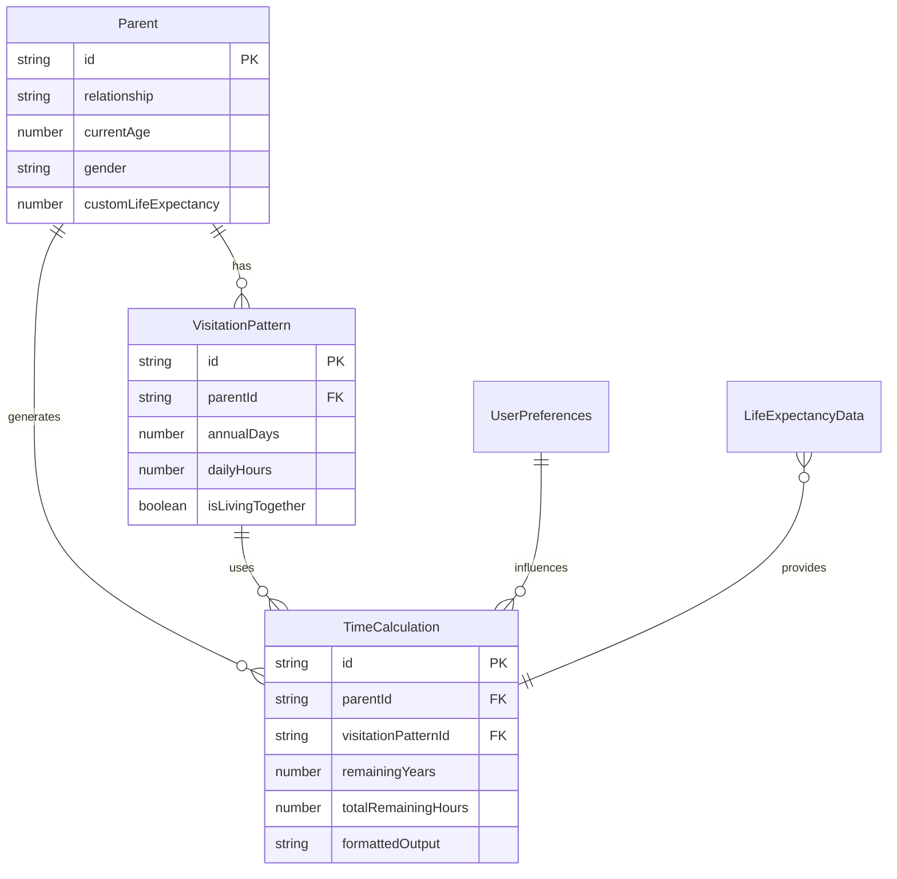

# Data Model: Parent Time Visualization Timer

**Feature Branch**: `001-1`  
**Date**: 2025-09-11  
**Status**: Complete

## Entity Definitions

### 1. Parent
Represents an individual parent with their demographic information.

```typescript
interface Parent {
  id: string;                    // Unique identifier (uuid)
  relationship: 'father' | 'mother' | 'other';
  currentAge: number;             // Current age in years (1-150)
  gender: 'male' | 'female';     // For life expectancy lookup
  customLifeExpectancy?: number; // Optional override for default
  createdAt: Date;
  updatedAt: Date;
}
```

**Validation Rules**:
- currentAge: Required, integer, range 1-150
- gender: Required for life expectancy calculation
- customLifeExpectancy: Optional, range currentAge-150

### 2. VisitationPattern
Defines how often and how long the user spends with parents.

```typescript
interface VisitationPattern {
  id: string;
  parentId: string;               // Foreign key to Parent
  annualDays: number;             // Days per year (0-365)
  dailyHours: number;             // Hours per day when together (0-24)
  isLivingTogether: boolean;      // Special case flag
  createdAt: Date;
  updatedAt: Date;
}
```

**Validation Rules**:
- annualDays: Required, range 0-365, decimal allowed
- dailyHours: Required, range 0-24, decimal allowed
- If isLivingTogether true: auto-set annualDays=365

### 3. TimeCalculation
The computed result of remaining time calculation.

```typescript
interface TimeCalculation {
  id: string;
  parentId: string;
  visitationPatternId: string;
  calculatedAt: Date;
  
  // Input snapshot (for history)
  inputAge: number;
  inputLifeExpectancy: number;
  inputAnnualDays: number;
  inputDailyHours: number;
  inputAgeBuffer: number;
  
  // Calculated values
  remainingYears: number;         // Years until life expectancy
  totalRemainingDays: number;     // Total days together
  totalRemainingHours: number;    // Total hours together
  
  // Display formats
  displayFormat: DisplayFormat;
  formattedOutput: string;
}
```

**Calculation Logic**:
```typescript
if (currentAge >= lifeExpectancy) {
  remainingYears = 1 + ageBuffer;
} else {
  remainingYears = (lifeExpectancy - currentAge) + ageBuffer;
}
totalRemainingDays = remainingYears * annualDays;
totalRemainingHours = totalRemainingDays * dailyHours;
```

### 4. UserPreferences
User-specific settings and display preferences.

```typescript
interface UserPreferences {
  id: string;
  userId?: string;                // Optional for future auth
  
  // Calculation settings
  ageBuffer: number;              // Additional years buffer (0-10)
  useCustomLifeExpectancy: boolean;
  
  // Display settings
  displayFormat: DisplayFormat;
  locale: 'ja' | 'en';
  theme: 'light' | 'dark' | 'auto';
  
  // Notification settings
  enableReminders: boolean;
  reminderFrequency?: 'weekly' | 'monthly' | 'quarterly';
  
  createdAt: Date;
  updatedAt: Date;
}

enum DisplayFormat {
  HOURS_ONLY = 'hours_only',
  DAYS_HOURS = 'days_hours',
  YEARS_MONTHS_DAYS = 'years_months_days',
  PROGRESSIVE = 'progressive'      // Shows most appropriate unit
}
```

**Validation Rules**:
- ageBuffer: Range 0-10, default 0
- displayFormat: Must be valid enum value
- locale: Supported languages only

### 5. LifeExpectancyData
Static data for Japanese life expectancy by year and gender.

```typescript
interface LifeExpectancyData {
  year: number;
  gender: 'male' | 'female';
  expectancy: number;             // Years
  source: string;                 // Data source citation
  updatedAt: Date;
}

// Hardcoded 2023 data
const LIFE_EXPECTANCY_2023 = {
  male: 81.09,
  female: 87.14,
  source: "Ministry of Health, Labour and Welfare of Japan (2023)"
};
```

## Relationships



## State Transitions

### TimeCalculation States
```
PENDING → CALCULATING → COMPLETED
         ↓
       ERROR
```

### Parent Lifecycle
```
DRAFT → ACTIVE → ARCHIVED
```

## Shared Types (Frontend/Backend)

```typescript
// Shared type definitions in shared/types.ts
export interface CalculationRequest {
  parent: Omit<Parent, 'id' | 'createdAt' | 'updatedAt'>;
  visitPattern: Omit<VisitationPattern, 'id' | 'parentId' | 'createdAt' | 'updatedAt'>;
  preferences: Pick<UserPreferences, 'ageBuffer' | 'displayFormat' | 'locale'>;
}

export interface CalculationResponse {
  success: boolean;
  calculation?: TimeCalculation;
  error?: {
    code: string;
    message: string;
  };
}
```

## Data Persistence Strategy

### Frontend (Local Storage)
```typescript
// Stored as JSON in localStorage
const STORAGE_KEYS = {
  parents: 'ptvt_parents',
  patterns: 'ptvt_patterns',
  preferences: 'ptvt_preferences',
  calculations: 'ptvt_calculations'  // Last 10 calculations
};
```

### Backend (Future Enhancement)
- PostgreSQL for relational data
- Redis for calculation cache
- Migration path from local storage

## Validation Rules Summary

| Field | Type | Required | Range | Default |
|-------|------|----------|-------|---------|
| Parent.currentAge | number | Yes | 1-150 | - |
| Parent.gender | enum | Yes | male/female | - |
| VisitationPattern.annualDays | number | Yes | 0-365 | - |
| VisitationPattern.dailyHours | number | Yes | 0-24 | - |
| UserPreferences.ageBuffer | number | No | 0-10 | 0 |
| UserPreferences.displayFormat | enum | No | - | PROGRESSIVE |
| UserPreferences.locale | enum | No | ja/en | en |

---
*Data model complete. Ready for API contract generation.*